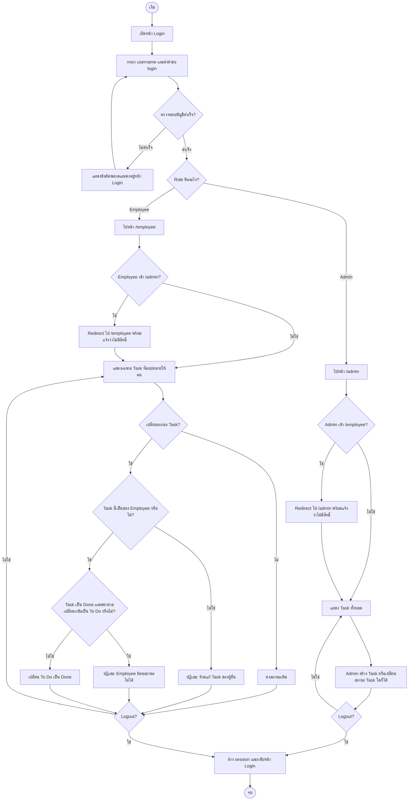

# Project Access Control — Flowchart

```mermaid
flowchart TD
    A([เริ่ม]) --> B[เปิดหน้า Login]
    B --> C[กรอก username และส่งคำขอ login]
    C --> D{ตรวจสอบบัญชีสำเร็จ?}
    D -- ไม่สำเร็จ --> E[แสดงข้อผิดพลาดและคงอยู่หน้า Login]
    E --> C
    D -- สำเร็จ --> F{Role คืออะไร?}
    F -- Admin --> G[ไปหน้า /admin]
    F -- Employee --> H[ไปหน้า /employee]

    G --> I{Admin เข้า /employee?}
    I -- ใช่ --> J[Redirect ไป /admin พร้อมแจ้งว่าไม่มีสิทธิ์]
    I -- ไม่ใช่ --> K[แสดง Task ทั้งหมด]
    J --> K
    K --> A1[Admin สร้าง Task หรือเปลี่ยนสถานะ Task ใดก็ได้]
    A1 --> U{Logout?}

    H --> L{Employee เข้า /admin?}
    L -- ใช่ --> M[Redirect ไป /employee พร้อมแจ้งว่าไม่มีสิทธิ์]
    L -- ไม่ใช่ --> N[แสดงเฉพาะ Task ที่มอบหมายให้ตน]
    M --> N
    N --> O{เปลี่ยนสถานะ Task?}
    O -- ไม่ --> P[คงสถานะเดิม]
    O -- ใช่ --> Q{Task นี้เป็นของ Employee หรือไม่?}
    Q -- ไม่ใช่ --> R[ปฏิเสธ: ห้ามแก้ Task ของผู้อื่น]
    Q -- ใช่ --> S{Task เป็น Done และพยายามเปลี่ยนกลับเป็น To Do หรือไม่?}
    S -- ใช่ --> T[ปฏิเสธ: Employee ย้อนสถานะไม่ได้]
    S -- ไม่ใช่ --> X[เปลี่ยน To Do เป็น Done]
    P --> Y{Logout?}
    R --> Y
    T --> Y
    X --> Y
    U -- ใช่ --> V[ล้าง session และกลับหน้า Login]
    U -- ไม่ใช่ --> K
    Y -- ไม่ใช่ --> N
    Y -- ใช่ --> V
    V --> W([จบ])
```
